<!--
[Слайд 1]
Привет всем! Сегодня мы поговорим про Apache Iceberg — но не как пользователи, а заглянем под капот. Разберём, как устроены метаданные, как работают чтение и запись, и почему Iceberg даёт ACID-гарантии. Это будет хардкорный технический доклад, так что приготовьтесь.

ACID:
- Atomicity (Атомарность): транзакция либо выполняется целиком, либо не выполняется вовсе.
- Consistency (Согласованность): транзакция переводит систему из одного согласованного состояния в другое.
- Isolation (Изолированность): параллельные транзакции не влияют друг на друга.
- Durability (Долговечность): если транзакция закоммичена, данные сохранены навсегда.
-->

# Apache Iceberg изнутри
## Глубокое погружение в архитектуру

Разберём, как устроен Iceberg под капотом: от метаданных до ACID-гарантий.

---

<!--
[Слайд 2]
Обо мне: краткая информация о спикере, его опыте и текущей роли.
-->

# Обо мне

## Андрей Татаринов

- Люблю узнавать как устроен мир и рассказывать об этом
- Founder Epoch8 - заказная ML-разработка
- ex-Google, ex-Yandex

---

<!--
[Слайд 3]
План у нас такой.
Сначала поговорим о боли. Почему старый добрый Hive Metastore и просто файлы на S3 перестали нас устраивать.
Затем разберём анатомию Iceberg. В этот раз мы пойдем СНИЗУ ВВЕРХ. От простых файлов с данными мы будем строить слои абстракций, пока не получим полноценную таблицу.
Потом перейдём к динамике: как происходят чтение и запись.
Посмотрим на киллер-фичи: Time Travel, эволюцию схемы и скрытое партиционирование.
И в конце — демо.
-->

# О чём поговорим

1. **Боль**: Почему Hive-таблицы ломаются на масштабе
2. **Архитектура**: Строим таблицу снизу вверх (Data -> Catalog)
3. **Механика**: Как работают Read, Write и ACID-транзакции
4. **Фичи**: Time Travel, Schema Evolution, Hidden Partitioning
5. **Практика**: Смотрим на файлы руками через PyIceberg + DuckDB

---

<!--
[Слайд 4]
Начнём с проблемы. Как мы привыкли работать с данными последние 10 лет? Hive-style таблицы.
Это по сути просто соглашение о структуре директорий.
Звучит просто, но на масштабе (PB данных) это катастрофа.

1. **O(N) Listing**: Чтобы спланировать запрос, нужно сделать листинг файлов. На S3 это очень медленно.
2. **Нет атомарности**: Если ETL упал на середине, читатели видят "грязные" данные.
3. **S3 Rename**: Переименование директорий в облаке — это копирование + удаление. Дорого и неатомарно.
4. **Жесткость**: Смена схемы или партиционирования требует полной перезаписи данных.
-->

# Проблема: Hive-таблицы на масштабе

Классический подход: `.../table/date=2024-01-01/*.parquet`

1. **🐢 O(N) Listing**: Чтобы спланировать запрос, нужно сделать `ls -R`. На S3 с миллионами файлов это занимает минуты.
2. **💥 Нет атомарности**: Job упал посередине записи? Читатели видят частично записанные ("грязные") данные.
3. **☁️ S3 Rename**: В облаках нет атомарного `rename`. Переименование директории = `copy` + `delete` всех файлов. Это медленно и дорого.
4. **🗿 Жесткость**: Смена схемы или партиционирования — боль. Часто требует полной перезаписи данных (Restatement).

---

<!--
[Слайд 5]
Iceberg — это ответ на эти проблемы. Это **Open Table Format**.
Давайте разберёмся с терминологией, потому что здесь часто возникает путаница.

1. **Это не файловый формат**: Iceberg сам не хранит данные. Он использует проверенные временем форматы: Parquet, ORC, Avro. Если вы откроете папку с данными Iceberg-таблицы, вы увидите обычные Parquet-файлы. Вы можете прочитать их любым тулом, даже без Iceberg (но получите "сырые" данные без учета удалений и версий).

2. **Это не движок (Engine)**: Iceberg — это библиотека и спецификация. У него нет своего сервера, который нужно поднимать.
   - Вы подключаете jar-ник к Spark — Spark начинает понимать Iceberg.
   - Вы подключаете плагин к Trino — Trino начинает понимать Iceberg.
   - DuckDB умеет читать Iceberg из коробки.
   Это позволяет строить **Data Lakehouse**: данные лежат в одном месте (S3), а работают с ними разные инструменты. Spark для тяжелых ETL, Trino для быстрой аналитики, Flink для стриминга.

3. **Это Спецификация**: Главное в Iceberg — это стандарт того, как именно мы организуем файлы, чтобы получить ACID-транзакции, Time Travel и Schema Evolution поверх обычного S3.

**Контекст рынка**: Iceberg не одинок.
- **Delta Lake**: Создан Databricks. Долгое время был проприетарным (частично), сейчас открыт. Очень крутой, но исторически сильно связан с экосистемой Spark/Databricks.
- **Apache Hudi**: Создан Uber. Фокусируется на стриминге и upsert-ах. Очень мощный, но сложнее в настройке и эксплуатации.
- **Iceberg**: Создан Netflix. Изначально проектировался как нейтральный, cloud-native формат для огромных таблиц. Сейчас де-факто становится стандартом для открытых Data Lakehouse.
-->

# Решение: Open Table Format

Iceberg — это **открытый табличный формат**.

- **Не файловый формат**: Использует Parquet/ORC/Avro для данных.
- **Не движок**: Работает с Spark, Trino, Flink, DuckDB.
- **Спецификация**: Описывает, как организовать файлы в таблицу с ACID-гарантиями.

> **Альтернативы**: Delta Lake (Databricks), Apache Hudi (Uber).

---

<!--
[Слайд 6]
В чём же фундаментальное отличие Iceberg от Hive?
В Hive состояние таблицы определяется состоянием файловой системы.
- Чтобы узнать, какие данные есть в таблице, нужно сделать `ls`.
- Чтобы удалить данные, нужно сделать `rm`.
Это работает для файловой системы, но не для базы данных.

Iceberg переворачивает эту концепцию: **Состояние таблицы определяется списком файлов в метаданных**.
Мы перестаём смотреть на директории. Нам всё равно, где лежат файлы. Они могут лежать в одной плоской папке, могут быть разбросаны по бакетам.
Главное — это **Manifest**, список, в котором написано:
1. Файл `data-a.parquet` принадлежит таблице.
2. В нём 1000 строк.
3. В колонке `id` значения от 1 до 1000.

Это даёт нам суперсилу:
- **O(1) Planning**: Нам не нужно листить директории. Мы читаем манифест и сразу знаем все файлы.
- **Атомарность**: Чтобы закоммитить транзакцию, мы просто атомарно подменяем список файлов. Было [A, B], стало [A, B, C]. Читатели либо видят старый список, либо новый. Никаких промежуточных состояний.

**Важный нюанс про ACID**:
Стандартный Iceberg Catalog (Hive, Glue, JDBC) гарантирует атомарность **только для одной таблицы**.
Если вы пишете в Table A и Table B — это две разные транзакции.
Чтобы получить ACID на несколько таблиц, нужны специальные каталоги с поддержкой веток (Branching), например **Project Nessie** или **LakeFS**. Они работают как Git для данных: коммит в ветку обновляет состояние сразу всего Data Lake.
-->

# Ключевая идея: Файлы, а не директории

Hive: "Что лежит в папке — то и таблица"
Iceberg: "Что записано в списке — то и таблица"

- **Отвязка от FS**: Файлы могут лежать где угодно.
- **Точный список**: Мы всегда знаем полный список файлов текущего снапшота.
- **Статистика**: Для каждого файла храним `min/max`, `null count`, `row count`.

---

<!--
[Слайд 7]
Давайте разберем анатомию Iceberg. И соберем ее снизу вверх так, чтобы было понятно зачем нужен каждый конкретный слой.
Мы начнем с данных и будем добавлять слои абстракции, решая по одной проблеме за раз.

Слой 1: Данные.
Слой 2: Как найти данные? (Manifest)
Слой 3: Как управлять кучей манифестов? (Manifest List)
Слой 4: Как хранить историю и схему? (Metadata File)
Слой 5: Где точка входа? (Catalog)
-->

# Анатомия: Строим таблицу снизу вверх

Мы пройдём путь от сырых данных до ACID-транзакций.

1. **Data Layer**: Данные и удаления.
2. **Index Layer**: Manifest Files.
3. **Snapshot Layer**: Manifest List.
4. **Metadata Layer**: Metadata File.
5. **Pointer Layer**: Catalog.

---

<!--
[Слайд 8]
Слой 1: **Data & Delete Files**.
В самом низу лежат обычные файлы: Parquet, ORC, Avro. Это наши данные.

Но что если мы хотим удалить строку? Переписывать весь файл дорого.
В Iceberg v2 появились **Delete Files**.
Мы пишем маленький файл, который говорит: "Строка X в файле Y удалена".
При чтении движок делает Merge-On-Read: читает данные и вычитает удаления.

При чтении движок (Spark/Trino) должен прочитать Data File и "вычесть" из него Delete File. Это называется Merge-On-Read.

Типы Delete Files:
1. **Position Deletes**: "Удалена строка №100 в файле A". (Быстро, используется чаще всего).
2. **Equality Deletes**: "Удалены все строки, где id=5". (Удобно для CDC, но медленнее при чтении).

Проблема этого слоя: У нас есть куча файлов на S3. Как понять, какие из них относятся к нашей таблице? `ls` делать нельзя (дорого).

Частый вопрос: "А где Update Files?". Их нет.
UPDATE в Iceberg — это всегда **DELETE** старой версии строки + **INSERT** новой версии.
Это позволяет не трогать существующие файлы данных (Immutable Data). Мы просто дописываем рядом маленький Delete File и новый Data File.

А как мы не удаляем новую строку? Ведь у нее тоже `id=10`?
Тут работают **Sequence Numbers**.
Delete File применяется только к данным, которые были записаны **раньше** него (строго меньший Sequence Number).
Новая строка записывается в той же транзакции, поэтому Delete File её игнорирует.
-->

# Слой 1: Data & Delete Files

Фундамент таблицы.

**Data Files**: Обычные Parquet/ORC файлы.
**Delete Files** (Merge-On-Read):
  - **Position Deletes**: "Удалена строка №100 в файле A".
  - **Equality Deletes**: "Удалены все строки, где id=5".


> **Проблема**: Файлов тысячи. Как узнать, какие именно файлы составляют таблицу, не делая медленный `ls`?

---

<!--
[Слайд 9]
Слой 2: **Manifest File**.
Решение: Давайте создадим файл-список!
Манифест — это файл (Avrо), в котором перечислены пути к файлам данных.

Но это не просто список. Это **индекс**.
Для каждого файла мы храним статистику:
- Row count
- Min/Max значения колонок (для отсечения файлов при чтении)
- Partition data

Теперь мы знаем, какие файлы читать.

Четкой спецификации на то, сколько должно быть манифестов и как по ним распределены данные - нет, движок решает это сам в момент записи

Но возникает новая проблема: Таблица растет. Манифест становится огромным. Или у нас тысячи манифестов (по одному на каждую запись). Как ими управлять?
-->

# Слой 2: Manifest File (`manifest.avro`)

**Решение**: Файл, который хранит список Data Files.

- **Список файлов**: `s3://.../data-a.parquet`, `s3://.../data-b.parquet`
- **Статистика (Index)**:
    - `row_count`: 10000
    - `lower_bounds`: `{id: 100}`
    - `upper_bounds`: `{id: 500}`
- **Partition Data**: К какой партиции относится файл.

> **Проблема**: При каждом коммите мы создаем новые манифесты. Как собрать их вместе в единое состояние таблицы?

---

<!--
[Слайд 10]
Слой 3: **Manifest List**.
Решение: Давайте создадим список манифестов!
Этот файл называется **Manifest List**. Он определяет **Снапшот** (Snapshot) — состояние таблицы в конкретный момент времени.

Manifest List тоже работает как индекс.
Он хранит диапазоны партиций для каждого манифеста.
Если запрос ищет данные за "2024-02-01", мы посмотрим в Manifest List и сразу отбросим манифесты за Январь.

Теперь у нас есть снапшот.
Но проблема: Таблица меняется во времени. Схемы меняются. Как хранить историю снапшотов и эволюцию схемы?
-->

# Слой 3: Manifest List (`snap-123.avro`)

**Решение**: Файл, который собирает манифесты в **Снапшот**.

- **Snapshot**: Полный набор данных таблицы в момент времени T.
- **Partition Pruning**: Хранит диапазоны партиций для каждого манифеста.
    - *Пример*: "В `manifest-a` лежат данные только за Январь".

> **Проблема**: Как хранить историю изменений (v1, v2, v3)? Как менять схему таблицы?

---

<!--
[Слайд 11]
Слой 4: **Metadata File**.
Решение: Главный файл описания таблицы — `metadata.json`.
Это "мозг" таблицы.

Что внутри:
1. **Схемы (Schemas)**: Список всех схем, которые когда-либо были у таблицы. Текущая схема + история изменений. Это позволяет читать старые файлы старой схемой.
2. **Партиционирование (Partition Specs)**: Тоже список! Если вы поменяли партиционирование с дней на месяцы, Iceberg помнит оба варианта. Старые данные лежат по дням, новые — по месяцам.
3. **История снапшотов (Snapshots)**: Список всех версий таблицы.
   - Snapshot 1 (вчера)
   - Snapshot 2 (сегодня утром)
   - Snapshot 3 (сейчас)
4. **Текущий снапшот (Current Snapshot ID)**: На какую версию мы смотрим прямо сейчас.

Каждое изменение таблицы (INSERT, UPDATE, ALTER TABLE) создает **НОВЫЙ** файл metadata.json (v1, v2, v3...). Старые файлы остаются для Time Travel.

Осталась последняя проблема: Как пользователю (Spark/Trino) найти этот `metadata.json`? И как гарантировать, что мы обновляем его атомарно?
-->

# Слой 4: Metadata File (`v2.metadata.json`)

**Решение**: JSON-файл, описывающий таблицу целиком.

- **Schemas**: История версий схемы.
- **Partition Specs**: История конфигураций партиционирования.
- **Snapshots**: Лог всех версий таблицы (`s1`, `s2`, `s3`...).
- **Current Snapshot**: Ссылка на актуальный Manifest List.

> **Проблема**: Где хранить ссылку на *текущий* metadata.json? Как обновлять его безопасно (ACID)?

---

<!--
[Слайд 12]
Слой 5: **Catalog**.
Решение: Внешнее хранилище, которое держит указатель на текущий metadata.json.
Это вершина нашей пирамиды.

Каталог должен поддерживать **CAS (Compare-And-Swap)**.
Операция коммита: "Обнови указатель на `v2.metadata.json`, ТОЛЬКО ЕСЛИ сейчас он равен `v1.metadata.json`".
Именно это дает нам ACID и линеаризуемость истории.

Это очень тонкий слой. По сути, это Key-Value хранилище:
`Table Name` -> `Location of current metadata.json`

Почему это важно? Потому что именно здесь происходит магия ACID-коммита.
Когда мы хотим обновить таблицу, мы используем операцию **CAS (Compare-And-Swap)**:
"Обнови указатель на `v2.metadata.json`, ТОЛЬКО ЕСЛИ сейчас он указывает на `v1.metadata.json`".

Если два писателя придут одновременно, один выиграет, а второй получит ошибку и должен будет сделать retry.
Это база для Optimistic Concurrency Control.

Реализации каталога могут быть любыми:
- **Hive Metastore**: Стандарт де-факто в Hadoop.
- **AWS Glue / DynamoDB**: В облаке.
- **REST Catalog**: Современный стандарт, просто HTTP API.
- **Nessie**: "Git for Data", позволяет делать ветки и мержи на уровне каталога.
-->

# Слой 5: Catalog

**Решение**: Атомарный указатель.

- **Задача**: Хранить ссылку на `current metadata location`.
- **ACID механизм**: `Compare-And-Swap` (CAS).
    - *Swap(Table, Expected=v1, New=v2)*
- **Реализации**:
    - 🐘 Hive Metastore, ☁️ AWS Glue, 🌐 REST Catalog, ...

> ✅ **Итог**: Мы построили структуру, которая гарантирует ACID и O(1) доступ к файлам.

---

<!--
[Слайд 13]
Прежде чем идти дальше, давайте углубимся в партиционирование.
В Iceberg это не просто структура папок, а логическая трансформация данных.
Мы определяем Partition Spec — набор правил трансформации колонок.
Это позволяет делать эффективный Pruning (отсечение) на этапе планирования.
-->

# Детальнее про Партиционирование

Как Iceberg группирует данные?

* **Partition Spec**: Конфигурация, описывающая, как получить ключ партиции из данных.
* **Transforms** (функции преобразования): `identity(category)`, `bucket(16, user_id)`,`truncate(4, name)`, `year/month/day/hour(ts)`

---

<!--
[Слайд 14]
Важные свойства партиционирования.
Партиции обеспечивают изоляцию данных: разные партиции всегда в разных файлах.
Это позволяет избегать конфликтов при записи в разные партиции.
И значения партиций хранятся в манифестах, что позволяет делать прунинг без чтения данных.
-->

# Свойства партиционирования

Почему это важно для производительности и консистентности?

- **Изоляция**: Данные разных партиций **всегда** лежат в разных файлах.
- **Конфликты**: Партиции — единица изоляции. Запись в разные партиции не конфликтует.
- **Индекс**: Значения партиций хранятся в манифестах (Pruning без чтения данных).

---

<!--
[Слайд 15]
Теперь, когда мы построили структуру, давайте посмотрим, как она работает в динамике.
Чтение (Read Path).
-->

# И как с этим всем работать?

---

<!--
[Слайд 16]
Первый шаг любого чтения — **Snapshot Isolation**.
Когда вы запускаете `SELECT * FROM table`, драйвер (Spark/Trino) идёт в Catalog и спрашивает: "Где metadata.json?".
Открывает `metadata.json` и смотрит поле `current-snapshot-id`.
Допустим, это `s3`.

Всё. С этого момента для вашего запроса таблица заморожена в состоянии `s3`.
Даже если через миллисекунду придет Writer и закоммитит `s4`, `s5`, `s6` — вы их не увидите.
Вы работаете в изолированном пузыре времени.

Это дает нам **Repeatable Reads** и **Consistency**.
Никаких "грязных чтений", никаких "фантомных строк".
-->

# Путь чтения: Snapshot Isolation

1. **Load Metadata**: Читаем `metadata.json` из каталога.
2. **Pick Snapshot**: Фиксируем `current-snapshot-id` (например, `s3`).
3. **Ignore Updates**: Все новые коммиты (`s4`, `s5`) игнорируются.

> 🛡️ Гарантирует консистентность данных на момент начала запроса.

---

<!--
[Слайд 17]
Мы зафиксировали снапшот. Теперь нам нужно найти файлы.
Iceberg использует **двухуровневую систему отсечения (Pruning)**.

Уровень 1: **Manifest List**.
Здесь мы отсекаем целые группы файлов по партициям.
Запрос: `WHERE date = '2024-02-01'`.
Мы смотрим в Manifest List. Видим манифест с диапазоном `date` [2024-01-01, 2024-01-31].
Пропускаем его целиком! Мы только что сэкономили чтение тысяч файлов.

Уровень 2: **Manifest File**.
Здесь мы отсекаем конкретные файлы по статистике колонок.
Запрос: `WHERE id = 123`.
Мы открываем оставшиеся манифесты. Смотрим на статистику каждого файла.
Файл A: `id` [0, 100]. Пропускаем.
Файл B: `id` [100, 200]. **Берём!**

В итоге из миллиона файлов мы реально будем читать только 10.
-->

# Pruning: Иерархия отсечения

Как найти иголку в стоге сена (быстро):

1. **Partition Pruning** (Manifest List):
   - Отсекаем **группы файлов** по диапазонам партиций.
   - `date` in [2024-01-01, 2024-01-31] ❌

2. **Min/Max Filtering** (Manifest File):
   - Отсекаем **отдельные файлы** по статистике колонок.
   - `id` in [0, 100] ❌

> 📉 Scan Planning отсекает 99% ненужных файлов.

---

<!--
[Слайд 18]
Итак, как происходит планирование?
В Hive, чтобы узнать, какие файлы читать, нам часто приходилось делать `list directories` на файловой системе. На S3 это медленно и дорого.
В Iceberg мы **никогда** не листим директории с данными.
Мы читаем Metadata File, затем Manifest List.
Если таблица огромная, Spark может запустить job *только для чтения манифестов*. Это называется **Distributed Planning**.
На выходе мы получаем набор `FileScanTask` — это конкретные инструкции: "прочитай файл X, байты с 0 по 1000".
Это позволяет планировать запросы к петабайтным таблицам за секунды.
-->

# Scan Planning

Как превратить SQL в план исполнения?

1. **Metadata Traversal**: Читаем Snapshot &rarr; Manifest List &rarr; Manifests.
2. **Filtering**: Применяем предикаты (Pruning) на лету.
3. **Split Generation**: Создаём задачи для чтения (Tasks).

🚀 **Почему это быстро?**
- **No File Listing**: Никаких `ls` по S3.
- **O(Metadata)**, а не O(Data).

---

<!--
[Слайд 19]
Переходим к записи (Write Path).
Это **Optimistic Concurrency Control**.
1. **Write Data**: Воркеры пишут Parquet-файлы на S3. Никаких блокировок. Если упадёт — останется мусор, не страшно.
2. **Write Manifests**: Драйвер собирает пути к файлам и их статистику (min/max), пишет манифест.
3. **Write Metadata**: Создаём новый `metadata.json` со ссылкой на новый манифест.
4. **Commit**: Самый важный шаг. Атомарная подмена указателя в каталоге.
"Поменяй `current-metadata` с `v1` на `v2`".
Если кто-то успел вклиниться — мы получим ошибку и уйдём на ретрай.
-->

# Путь записи: Анатомия коммита


---

<!--
[Слайд 20]
Iceberg использует **Optimistic Concurrency Control (OCC)**.
Мы исходим из того, что конфликты редки.
Никаких глобальных блокировок на запись.
Алгоритм:
1. Читаем текущий снапшот (Base).
2. Готовим изменения (пишем файлы).
3. Пытаемся сделать CAS.
4. Если не вышло (кто-то успел раньше) — мы не падаем сразу.
5. Мы смотрим, что именно изменилось, и пытаемся "перебазировать" (Rebase) свои изменения поверх новых.
-->

# Optimistic Concurrency Control



1. **No Locks**: Писатели не блокируют друг друга.
2. **Retry Loop**: Если CAS не прошёл, мы не падаем, а пытаемся снова.
3. **Conflict Resolution**: Проверяем, совместимы ли наши изменения с чужими.

---

<!--
[Слайд 21]
Но не каждый провал CAS — это ошибка.
Iceberg проверяет **логические конфликты**.

Пример 1:
Я добавляю данные за **Январь**.
Коллега добавляет данные за **Февраль**.
Мы мешаем друг другу? Нет.
Iceberg просто применит мой коммит поверх его коммита.

Пример 2:
Я читаю файл A и удаляю из него строки.
Коллега удаляет файл A целиком.
Конфликт! Моя операция невалидна. Тут мы упадём с ошибкой.

Это позволяет держать **высокий параллелизм** на запись (особенно для Append-only).

Важно: независимость операций (например, Append и Compaction) определяется по **партициям**.
Если мы пишем в одну партицию, а компактим другую — конфликта нет.
Поэтому какое-то партиционирование в таблице всегда нужно, даже если это просто bucket(16, id), чтобы размазать нагрузку и уменьшить вероятность конфликтов.
-->

# Разрешение конфликтов

Не все коллизии фатальны. Iceberg проверяет совместимость операций.

| Моя операция | Чужая операция | Результат |
| :--- | :--- | :--- |
| **Append** (Part A) | **Append** (Part B) | ✅ Success (Rebase) |
| **Append** (Part A) | **Compaction** (Part B) | ✅ Success |
| **Update** (File X) | **Delete** (File X) | ❌ Conflict |
| **Delete** (File X) | **Delete** (File X) | ❌ Conflict |

> 💡 **Isolation Level**: Serializable / Snapshot Isolation.

---

<!--
[Слайд 22]
Одна из лучших фич для пользователей — **Hidden Partitioning**.

В Hive партиционирование было физическим. Вы создавали колонку-костыль `day_str`.
Пользователи постоянно забывали добавить фильтр по `day_str`, делали фильтр только по `timestamp`.
Результат: Full Table Scan и лежащий кластер.

В Iceberg партиционирование — это **функция** от данных.
`PARTITIONED BY (days(ts))`
Пользователь пишет запрос как обычно: `WHERE ts > ...`.
Iceberg сам понимает: "Ага, `ts` связан с партицией `days(ts)`, значит мне нужны папки от такой-то даты".
Это спасает от человеческих ошибок.

Q: Какие функции допустимы? Везде ли они работают одинаково?
A: Набор фиксирован в спецификации: `identity`, `bucket[N]`, `truncate[W]`, `year`, `month`, `day`, `hour`, `void`.
Они работают **бинарно идентично** во всех реализациях (Java, Python, Rust, C++). Это строгое требование спеки. Файл, записанный Spark, гарантированно прочитается в DuckDB.

Q: А если я захочу свою функцию?
A: **Нельзя**. Спецификация не поддерживает UDF для партиционирования, иначе сломалась бы совместимость между движками.
Если нужна кастомная логика — вычисляйте значение сами, пишите в отдельную колонку и используйте `identity` transform.
-->

# Hidden Partitioning

Партиционирование — это **конфигурация**, а не схема.

<div style="display: flex; gap: 20px;">
<div style="flex: 1;">

### 🐢 Hive Style
```sql
CREATE TABLE logs (
  ts timestamp,
  ...
) PARTITIONED BY (day_str string);

-- Query
SELECT * FROM logs
WHERE ts > '2024-02-01'
  AND day_str >= '2024-02-01';
-- 😫 Нужно знать про day_str!
```

</div>
<div style="flex: 1;">

### 🧊 Iceberg Style
```sql
CREATE TABLE logs (
  ts timestamp,
  ...
) PARTITIONED BY (days(ts));

-- Query
SELECT * FROM logs
WHERE ts > '2024-02-01';

-- 😎 Iceberg сам поймёт что читать
```

</div>
</div>

---

<!--
[Слайд 23]
Schema Evolution — это боль в Hive.
Удалили колонку в середине? Все данные сместились.
Переименовали? Parquet потерял связь.

В Iceberg всё строится на **Unique Column IDs**.
Имя колонки — это просто ярлык для человека.
Внутри Iceberg оперирует ID: 1, 2, 3...

Пример:
Было: `1: id`, `2: data`.
Сделали `RENAME data -> payload`.
Стало: `1: id`, `2: payload`.

Когда мы читаем старый файл, мы ищем в нём поле с **ID=2**.
Нам не важно, как оно называлось при записи.
Это позволяет делать `ADD`, `DROP`, `RENAME`, `REORDER` мгновенно, без переписывания файлов.

Важный момент: `metadata.json` хранит **историю всех схем**.
Файл A мог быть записан со схемой v1, а файл B — со схемой v2.
При чтении Iceberg приводит всё к актуальной схеме, используя ID колонок.
-->

# Эволюция схемы (Schema Evolution)

- **ID-based tracking**: Колонки связаны по ID, а не по имени.
- **Instant Operations**: Все изменения схемы — это только обновление метаданных.
- **Schema History**: Метаданные хранят все версии схем.

```json
{
  "type": "struct",
  "fields": [
    { "id": 1, "name": "id", "type": "int" },
    { "id": 2, "name": "data", "type": "string" }
  ]
}
```

---

<!--
[Слайд 24]
Time Travel — это возможность вернуться в прошлое.
Так как Iceberg использует **Immutable** файлы и снапшоты, старые данные никуда не деваются (пока вы их не удалите явно).

Мы можем просто сказать: "Прочитай таблицу, используя корень дерева метаданных из снапшота #123".

Сценарии:
1. **Аудит**: Как выглядел баланс пользователя на 1 января?
2. **Отладка**: Вчера пайплайн упал. Давайте посмотрим на данные "как вчера".
3. **ML**: Обучение модели на фиксированном датасете для воспроизводимости.

Q: И что, данные никогда не удаляются? А если удаляются, то как я могу гарантировать откат на такую-то дату?
A: Данные удаляются физически только процедурой `expire_snapshots`.
Пока вы её не запустили — данные лежат вечно (и вы платите за S3).
Обычно настраивают Retention Policy: например, хранить историю 7 дней.
Если вам нужно гарантировать откат на год назад (для аудита) — вы просто ставите retention 365 дней.
-->

# Time Travel

Машина времени для ваших данных.

```sql
-- Вернуться к состоянию на конкретное время
SELECT * FROM events
FOR SYSTEM_TIME AS OF '2024-02-01 12:00:00';

-- Вернуться к конкретному снапшоту (по ID)
SELECT * FROM events
FOR SYSTEM_VERSION AS OF 83627462847462;
```

### 🛠 Use Cases:
- **Audit**: "Что было в таблице месяц назад?"
- **Rollback**: "Откатить плохой деплой данных".

---

<!--
[Слайд 25]
Iceberg — это не магия. За таблицами нужно ухаживать.
Если вы постоянно пишете мелкие файлы (Streaming), через неделю у вас будет миллион файлов и тормоза.

Три главные процедуры обслуживания:
1. **Compaction**: Берём кучу мелких файлов, переписываем в один большой. Это атомарная операция (замена файлов в снапшоте).
2. **Expire Snapshots**: Удаляем старые версии. Именно здесь происходит физическое удаление файлов с диска.
3. **Orphan Files**: Сбор мусора. Если Spark упал посередине записи, он мог оставить файлы. Эта процедура их найдёт и удалит.
-->

# Обслуживание таблиц (Maintenance)

Таблицы требуют ухода, иначе они деградируют.

1. Compaction (Small Files Problem)
2. Expire Snapshots (Vacuum)
3. Remove Orphan Files (GC)
  *Удаляет мусор от упавших транзакций.*

---

<!--
[Слайд 26]
Теперь давайте соберем всё вместе и посмотрим на эволюцию таблицы в динамике.
Как переиспользуются манифесты и файлы при изменениях.
-->

# Пример: Эволюция таблицы

---

<!--
[Слайд 27]
Давайте посмотрим, как меняется структура таблицы во времени.
Шаг 1: Начальное состояние.
У нас есть Metadata v1, Snapshot v1.
Один манифест, два файла данных.
-->

# Эволюция: Шаг 1 (Initial Commit)



---

<!--
[Слайд 28]
Шаг 2: Мы добавили данные (Append).
Создался Metadata v2 и Snapshot v2.
Snapshot v2 ссылается на:
1. Старый манифест (мы его переиспользуем!).
2. Новый манифест с новыми данными.
Старый Snapshot v1 остался в истории.
-->

# Эволюция: Шаг 2 (Append Data)



---

<!--
[Слайд 29]
Шаг 3: Мы переписали файл data-001 (например, сделали Compact или Update).
Создался Snapshot v3.
1. Manifest-new переиспользуется (data-003 не менялся).
2. Manifest-old заменен на Manifest-rewritten.
3. Manifest-rewritten указывает на новую версию data-001-v2 и старый data-002.
Старые файлы и манифесты не удалены, они просто остались в истории (Snapshot v1, v2).
-->

# Эволюция: Шаг 3 (Rewrite Data)


---

<!--
[Слайд 30]
Демо.
Мы создадим таблицу, попишем в неё и посмотрим на файлы.
-->

# Демо: Анатомия на практике

🛠 **Инструменты**: PyIceberg

### Сценарий:
1. **Init**: Создаём таблицу `taxi_dataset`.
2. **Inspect**: Смотрим на структуру папок (`metadata/`, `data/`).
3. **Append**: Добавляем данные, видим новый снапшот.
4. **Time Travel**: Читаем старую версию.
5. **Pruning**: Демонстрация отсечения файлов.

> 👨‍💻 Переключаюсь на терминал...

---

<!--
[Слайд 31]
Итоги.
Мы построили таблицу снизу вверх и поняли, зачем нужен каждый слой.
Iceberg — это стандарт для Data Lakehouse.

Главное, что нужно запомнить:
1. Всё состояние — в дереве метаданных.
2. Планирование запросов — это работа с метаданными, а не листинг файлов.
3. Конфликты решаются оптимистично (OCC).
-->

# Итоги

Apache Iceberg превращает Data Lake в Data Warehouse.

1. **Metadata Tree**: `Catalog` &rarr; `Metadata` &rarr; `Manifest List` &rarr; `Manifest` &rarr; `Data`.
2. **Performance**: Pruning отсекает 99% файлов без чтения данных.
3. **Reliability**: ACID транзакции, Safe Schema Evolution.
4. **Usability**: Hidden Partitioning, Time Travel.

### 🔗 Полезные ссылки:
- 📄 **Spec**: iceberg.apache.org/spec
- 🐙 **Code**: github.com/apache/iceberg

---

<!--
[Слайд 32]
Спасибо за внимание! Готов ответить на вопросы.
-->

# Вопросы?
