<!--
[Слайд 1]
Привет всем! Сегодня мы поговорим про Apache Iceberg — но не как пользователи, а заглянем под капот. Разберём, как устроены метаданные, как работают чтение и запись, и почему Iceberg даёт ACID-гарантии. Это будет хардкорный технический доклад, так что приготовьтесь.

ACID:
- Atomicity (Атомарность): транзакция либо выполняется целиком, либо не выполняется вовсе.
- Consistency (Согласованность): транзакция переводит систему из одного согласованного состояния в другое.
- Isolation (Изолированность): параллельные транзакции не влияют друг на друга.
- Durability (Долговечность): если транзакция закоммичена, данные сохранены навсегда.
-->

# Apache Iceberg изнутри
## Глубокое погружение в архитектуру

Разберём, как устроен Iceberg под капотом: от метаданных до ACID-гарантий.

---

<!--
[Слайд 2]
Обо мне: краткая информация о спикере, его опыте и текущей роли.
-->

# Обо мне

## Андрей Татаринов

- Люблю узнавать как устроен мир и рассказывать об этом
- Founder Epoch8 - заказная ML-разработка
- ex-Google, ex-Yandex

---

<!--
[Слайд 3]
План у нас такой.
Сначала поговорим о боли. Почему старый добрый Hive Metastore и просто файлы на S3 перестали нас устраивать, когда данных стало много.
Затем разберём анатомию Iceberg. Это самая важная часть: мы посмотрим на дерево метаданных, поймём, что такое Manifest List и Manifest File.
Потом перейдём к динамике: как происходят чтение и запись. Разберём Write Path, как работает Optimistic Concurrency Control и откуда берутся ACID-гарантии.
Посмотрим на киллер-фичи: Time Travel, эволюцию схемы и скрытое партиционирование.
И в конце — демо. Создадим таблицу, попишем в неё и посмотрим на JSON-файлы метаданных своими глазами.
-->

# О чём поговорим

1. **Боль**: Почему Hive-таблицы ломаются на масштабе
2. **Архитектура**: Как Iceberg устроен внутри (Metadata, Manifests)
3. **Механика**: Как работают Read, Write и ACID-транзакции
4. **Фичи**: Time Travel, Schema Evolution, Hidden Partitioning
5. **Практика**: Смотрим на файлы руками через PyIceberg + DuckDB

---

<!--
[Слайд 4]
Начнём с проблемы. Как мы привыкли работать с данными последние 10 лет? Hive-style таблицы.
Это по сути просто соглашение о структуре директорий: "все Parquet-файлы в папке /data/table/date=2024-01-01/ — это данные за 1 января".
Звучит просто и понятно, можно зайти через `ls` и посмотреть. Но на масштабе (PB данных, тысячи партиций) это превращается в катастрофу.

1. **O(N) Listing**: Чтобы спланировать запрос `SELECT * FROM table WHERE date > '2024-01-01'`, драйверу нужно сделать листинг всех директорий и файлов. На S3 `LIST` — это медленная операция. Если у вас миллион файлов, планирование запроса может занимать минуты, даже если сам запрос читает 10 строк.

2. **Нет атомарности**: Представьте, что ETL-job пишет данные. Он записал 50 файлов из 100 и упал (OOM, network issue).
   - В базе данных транзакция бы откатилась.
   - В Hive читатели мгновенно видят эти 50 файлов. Они видят "грязные", частичные данные.
   - Чтобы починить, нужно руками идти и удалять эти файлы.

3. **S3 Rename**: В HDFS `rename` директории — это атомарная операция (смена указателя в NameNode). В S3 (и других Object Storage) `rename` не существует. Это `COPY` нового объекта + `DELETE` старого.
   - Это медленно (копирование гигабайтов данных).
   - Это дорого (API calls).
   - Это не атомарно (в процессе копирования читатели могут видеть дубли или отсутствие данных).

4. **Жесткость (Rigidity)**:
   - **Партиционирование**: Вы выбрали партиционирование по дням. Через год данных стало больше, нужно по часам. В Hive вы не можете просто поменять конфиг. Вам нужно переписать ВСЮ таблицу (Restatement), физически переложить данные в новые папки.
   - **Схема**: Хотите переименовать колонку `user_id` в `customer_id`? В Parquet схема зашита в файл. Hive мапит колонки по имени (или по индексу). Переименование часто ломает чтение старых файлов, где старое имя.

Q: А что, кроме Hive ничего не было?
A: В мире Open Source Data Lake — по сути нет.
- Были **MPP (Vertica, Greenplum)**, но это закрытые системы, туда надо грузить данные.
- Был **Hive ACID**, но он сложный и привязан к Hive-движку (Spark с ним плохо дружил).
- Был **Kudu**, но это активный сторадж (сервера), а не просто файлы на S3.
- Поэтому для "просто файлов на S3" Hive был единственным стандартом.
-->

# Проблема: Hive-таблицы на масштабе

Классический подход: `.../table/date=2024-01-01/*.parquet`

1. **🐢 O(N) Listing**: Чтобы спланировать запрос, нужно сделать `ls -R`. На S3 с миллионами файлов это занимает минуты.
2. **💥 Нет атомарности**: Job упал посередине записи? Читатели видят частично записанные ("грязные") данные.
3. **☁️ S3 Rename**: В облаках нет атомарного `rename`. Переименование директории = `copy` + `delete` всех файлов. Это медленно и дорого.
4. **🗿 Жесткость**: Смена схемы или партиционирования — боль. Часто требует полной перезаписи данных (Restatement).

---

<!--
[Слайд 5]
Iceberg — это ответ на эти проблемы. Это **Open Table Format**.
Давайте разберёмся с терминологией, потому что здесь часто возникает путаница.

1. **Это не файловый формат**: Iceberg сам не хранит данные. Он использует проверенные временем форматы: Parquet, ORC, Avro. Если вы откроете папку с данными Iceberg-таблицы, вы увидите обычные Parquet-файлы. Вы можете прочитать их любым тулом, даже без Iceberg (но получите "сырые" данные без учета удалений и версий).

2. **Это не движок (Engine)**: Iceberg — это библиотека и спецификация. У него нет своего сервера, который нужно поднимать.
   - Вы подключаете jar-ник к Spark — Spark начинает понимать Iceberg.
   - Вы подключаете плагин к Trino — Trino начинает понимать Iceberg.
   - DuckDB умеет читать Iceberg из коробки.
   Это позволяет строить **Data Lakehouse**: данные лежат в одном месте (S3), а работают с ними разные инструменты. Spark для тяжелых ETL, Trino для быстрой аналитики, Flink для стриминга.

3. **Это Спецификация**: Главное в Iceberg — это стандарт того, как именно мы организуем файлы, чтобы получить ACID-транзакции, Time Travel и Schema Evolution поверх обычного S3.

**Контекст рынка**: Iceberg не одинок.
- **Delta Lake**: Создан Databricks. Долгое время был проприетарным (частично), сейчас открыт. Очень крутой, но исторически сильно связан с экосистемой Spark/Databricks.
- **Apache Hudi**: Создан Uber. Фокусируется на стриминге и upsert-ах. Очень мощный, но сложнее в настройке и эксплуатации.
- **Iceberg**: Создан Netflix. Изначально проектировался как нейтральный, cloud-native формат для огромных таблиц. Сейчас де-факто становится стандартом для открытых Data Lakehouse.
-->

# Решение: Open Table Format

Iceberg — это **открытый табличный формат**.

- **Не файловый формат**: Использует Parquet/ORC/Avro для данных.
- **Не движок**: Работает с Spark, Trino, Flink, DuckDB.
- **Спецификация**: Описывает, как организовать файлы в таблицу с ACID-гарантиями.

> **Альтернативы**: Delta Lake (Databricks), Apache Hudi (Uber).

---

<!--
[Слайд 6]
В чём же фундаментальное отличие Iceberg от Hive?
В Hive состояние таблицы определяется состоянием файловой системы.
- Чтобы узнать, какие данные есть в таблице, нужно сделать `ls`.
- Чтобы удалить данные, нужно сделать `rm`.
Это работает для файловой системы, но не для базы данных.

Iceberg переворачивает эту концепцию: **Состояние таблицы определяется списком файлов в метаданных**.
Мы перестаём смотреть на директории. Нам всё равно, где лежат файлы. Они могут лежать в одной плоской папке, могут быть разбросаны по бакетам.
Главное — это **Manifest**, список, в котором написано:
1. Файл `data-a.parquet` принадлежит таблице.
2. В нём 1000 строк.
3. В колонке `id` значения от 1 до 1000.

Это даёт нам суперсилу:
- **O(1) Planning**: Нам не нужно листить директории. Мы читаем манифест и сразу знаем все файлы.
- **Атомарность**: Чтобы закоммитить транзакцию, мы просто атомарно подменяем список файлов. Было [A, B], стало [A, B, C]. Читатели либо видят старый список, либо новый. Никаких промежуточных состояний.

**Важный нюанс про ACID**:
Стандартный Iceberg Catalog (Hive, Glue, JDBC) гарантирует атомарность **только для одной таблицы**.
Если вы пишете в Table A и Table B — это две разные транзакции.
Чтобы получить ACID на несколько таблиц, нужны специальные каталоги с поддержкой веток (Branching), например **Project Nessie** или **LakeFS**. Они работают как Git для данных: коммит в ветку обновляет состояние сразу всего Data Lake.
-->

# Ключевая идея: Файлы, а не директории

Hive: "Что лежит в папке — то и таблица"
Iceberg: "Что записано в списке — то и таблица"

- **Отвязка от FS**: Файлы могут лежать где угодно.
- **Точный список**: Мы всегда знаем полный список файлов текущего снапшота.
- **Статистика**: Для каждого файла храним `min/max`, `null count`, `row count`.

---

<!--
[Слайд 7]
Теперь самое интересное — анатомия. Как именно Iceberg хранит этот "список файлов"?
Это не один гигантский файл (он бы не масштабировался). Это дерево.
Дерево метаданных.

Снизу вверх:
1. **Data Files**: Сами данные (Parquet).
2. **Manifest Files**: Списки файлов данных. Один манифест может хранить ссылки на тысячи файлов.
3. **Manifest List**: Список манифестов. Собирает манифесты в один Снапшот.
4. **Metadata File**: Корень дерева для конкретной версии таблицы. Хранит историю снапшотов.
5. **Catalog**: Указатель на "текущий" Metadata File.

Когда мы читаем таблицу, мы идем сверху вниз: Catalog -> Metadata -> Manifest List -> Manifests -> Data.
Когда мы пишем, мы создаем новые ветки этого дерева снизу вверх и в конце атомарно переключаем указатель в каталоге.
-->

# Анатомия Iceberg-таблицы



---

<!--
[Слайд 8]
Начнём с вершины. **Catalog**.
Его единственная задача — знать, где лежит **текущий** файл метаданных (`metadata.json`).
Это очень тонкий слой. По сути, это Key-Value хранилище:
`Table Name` -> `Location of current metadata.json`

Почему это важно? Потому что именно здесь происходит магия ACID-коммита.
Когда мы хотим обновить таблицу, мы используем операцию **CAS (Compare-And-Swap)**:
"Обнови указатель на `v2.metadata.json`, ТОЛЬКО ЕСЛИ сейчас он указывает на `v1.metadata.json`".

Если два писателя придут одновременно, один выиграет, а второй получит ошибку и должен будет сделать retry.
Это база для Optimistic Concurrency Control.

Реализации каталога могут быть любыми:
- **Hive Metastore**: Стандарт де-факто в Hadoop.
- **AWS Glue / DynamoDB**: В облаке.
- **REST Catalog**: Современный стандарт, просто HTTP API.
- **Nessie**: "Git for Data", позволяет делать ветки и мержи на уровне каталога.
-->

# Catalog

**Задача**: Хранить атомарный указатель на текущий `metadata.json`.

- **Абстракция**: `Map<TableName, MetadataLocation>`
- **Требование**: Поддержка `CAS` (Compare-And-Swap) для ACID.
- **Реализации**:
    - 🐘 Hive Metastore
    - ☁️ AWS Glue / DynamoDB
    - 🌐 REST Catalog
    - 🐙 Nessie (Git-like semantics)

---

<!--
[Слайд 9]
Спускаемся на уровень ниже. **Metadata File**.
Это JSON-файл, который описывает таблицу целиком.
Если у вас есть этот файл, вы знаете о таблице всё.

Что внутри:
1. **Схемы (Schemas)**: Список всех схем, которые когда-либо были у таблицы. Текущая схема + история изменений. Это позволяет читать старые файлы старой схемой.
2. **Партиционирование (Partition Specs)**: Тоже список! Если вы поменяли партиционирование с дней на месяцы, Iceberg помнит оба варианта. Старые данные лежат по дням, новые — по месяцам.
3. **История снапшотов (Snapshots)**: Список всех версий таблицы.
   - Snapshot 1 (вчера)
   - Snapshot 2 (сегодня утром)
   - Snapshot 3 (сейчас)
4. **Текущий снапшот (Current Snapshot ID)**: На какую версию мы смотрим прямо сейчас.

Каждое изменение таблицы (INSERT, UPDATE, ALTER TABLE) создает **НОВЫЙ** файл metadata.json (v1, v2, v3...). Старые файлы остаются для Time Travel.
-->

# Metadata File (`v2.metadata.json`)

Мозг таблицы. Хранит **всё** состояние.

- **Schemas**: Список всех версий схемы (v1, v2...).
- **Partition Specs**: История изменений партиционирования.
- **Snapshots**: История коммитов (`s1`, `s2`, `s3`...)
- **Current Snapshot**: `s3`

> 💡 Каждый коммит создает новый JSON файл. Старые остаются.

---

<!--
[Слайд 10]
Идем дальше. Снапшот указывает на **Manifest List**.
Зачем нужен этот промежуточный слой? Почему не хранить список файлов прямо в Metadata File?
Потому что файлов может быть МИЛЛИОНЫ. Если хранить их в JSON, он распухнет до гигабайтов, и мы не сможем его быстро читать.

Поэтому мы группируем файлы в пачки — **Манифесты**.
А Manifest List — это список этих пачек.

Но это не просто список ссылок. Это **индекс**.
Для каждого манифеста здесь хранится статистика:
- В этом манифесте лежат данные за `date` от `2024-01-01` до `2024-01-05`.
- В этом манифесте лежат данные для `bucket_id` = 0.

Это позволяет делать **Partition Pruning** на самом верхнем уровне.
Если запрос `WHERE date = '2024-02-01'`, мы даже не будем открывать манифесты за январь. Мы их просто пропустим.
-->

# Manifest List (`snap-123.avro`)

Список манифестов, из которых состоит Снапшот.

- **Формат**: Avro (компактный, бинарный).
- **Роль**: Индекс для Partition Pruning.
- **Содержит**:
    - Путь к Manifest File.
    - Диапазоны значений partition-колонок (Min/Max).
    - `added_files_count`, `deleted_files_count`.

---

<!--
[Слайд 11]
И наконец, **Manifest File**.
Это список самих файлов данных.
Но опять же, это не просто список путей. Это **богатый индекс**.

Для каждого файла мы храним:
1. **Partition Data**: К какой партиции относится файл.
2. **Metrics**:
   - Сколько строк (`row_count`).
   - Сколько null-ов в каждой колонке (`null_value_counts`).
   - **Lower Bounds / Upper Bounds**: Минимальное и максимальное значение для КАЖДОЙ колонки (или для ключевых).

Зачем это нужно? Для **Min/Max Filtering**.
Представьте запрос: `SELECT * FROM logs WHERE user_id = 12345`.
Iceberg открывает манифест, смотрит на статистику файла `data-a.parquet`:
- `user_id_min`: 100
- `user_id_max`: 500
12345 не попадает в диапазон [100, 500]. Значит, этот файл можно пропустить. Мы даже не будем делать запрос к S3, чтобы прочитать его футер.
-->

# Manifest File (`manifest-abc.avro`)

Список Data Files с детальной статистикой.

- **Data File Entry**:
    - `file_path`: `s3://.../data.parquet`
    - `partition`: `{date: 2024-01-01}`
    - `metrics`:
        - `row_count`: 10000
        - `lower_bounds`: `{id: 100}`
        - `upper_bounds`: `{id: 500}`

> 🚀 Позволяет пропускать файлы (Skipping) без чтения данных.

---

<!--
[Слайд 12]
Ну и в самом низу — **Data Files**.
Здесь всё просто. Это обычные файлы (Parquet/ORC/Avro).

Но есть нюанс. В Iceberg v2 (Row-Level Deletes) появились **Delete Files**.
Если мы удаляем строку, мы не переписываем весь гигабайтный Parquet-файл (это было бы Copy-On-Write, и это долго).
Вместо этого мы пишем маленький **Delete File**, в котором говорим: "Строка X в файле Y удалена".

При чтении движок (Spark/Trino) должен прочитать Data File и "вычесть" из него Delete File. Это называется Merge-On-Read.

Типы Delete Files:
1. **Position Deletes**: "Удалена строка №100 в файле A". (Быстро, используется чаще всего).
2. **Equality Deletes**: "Удалены все строки, где id=5". (Удобно для CDC, но медленнее при чтении).

Частый вопрос: "А где Update Files?". Их нет.
UPDATE в Iceberg — это всегда **DELETE** старой версии строки + **INSERT** новой версии.
Это позволяет не трогать существующие файлы данных (Immutable Data). Мы просто дописываем рядом маленький Delete File и новый Data File.

А как мы не удаляем новую строку? Ведь у нее тоже `id=10`?
Тут работают **Sequence Numbers**.
Delete File применяется только к данным, которые были записаны **раньше** него (строго меньший Sequence Number).
Новая строка записывается в той же транзакции, поэтому Delete File её игнорирует.
-->

# Data & Delete Files

Iceberg хранит не только данные, но и "анти-данные".

- **Data Files**: Обычные Parquet/ORC файлы с данными.
- **Delete Files** (Merge-On-Read):
    - **Position Deletes**: Ссылка на файл + номер строки.
    - **Equality Deletes**: Предикат (`id = 5`).

> ⚠️ При чтении движок делает `Data - Deletes`.

---

<!--
[Слайд 13]
Мы разобрали, как данные лежат на диске. Это была статика.
Теперь давайте посмотрим на динамику. Как движок (Spark, Trino) использует эту структуру, чтобы быстро читать данные?
-->

# И как с этим всем работать?

---

<!--
[Слайд 14]
Первый шаг любого чтения — **Snapshot Isolation**.
Когда вы запускаете `SELECT * FROM table`, драйвер (Spark/Trino) идёт в Catalog и спрашивает: "Где metadata.json?".
Открывает `metadata.json` и смотрит поле `current-snapshot-id`.
Допустим, это `s3`.

Всё. С этого момента для вашего запроса таблица заморожена в состоянии `s3`.
Даже если через миллисекунду придет Writer и закоммитит `s4`, `s5`, `s6` — вы их не увидите.
Вы работаете в изолированном пузыре времени.

Это дает нам **Repeatable Reads** и **Consistency**.
Никаких "грязных чтений", никаких "фантомных строк".
-->

# Путь чтения: Snapshot Isolation

1. **Load Metadata**: Читаем `metadata.json` из каталога.
2. **Pick Snapshot**: Фиксируем `current-snapshot-id` (например, `s3`).
3. **Ignore Updates**: Все новые коммиты (`s4`, `s5`) игнорируются.

> 🛡️ Гарантирует консистентность данных на момент начала запроса.

---

<!--
[Слайд 15]
Мы зафиксировали снапшот. Теперь нам нужно найти файлы.
Iceberg использует **двухуровневую систему отсечения (Pruning)**.

Уровень 1: **Manifest List**.
Здесь мы отсекаем целые группы файлов по партициям.
Запрос: `WHERE date = '2024-02-01'`.
Мы смотрим в Manifest List. Видим манифест с диапазоном `date` [2024-01-01, 2024-01-31].
Пропускаем его целиком! Мы только что сэкономили чтение тысяч файлов.

Уровень 2: **Manifest File**.
Здесь мы отсекаем конкретные файлы по статистике колонок.
Запрос: `WHERE id = 123`.
Мы открываем оставшиеся манифесты. Смотрим на статистику каждого файла.
Файл A: `id` [0, 100]. Пропускаем.
Файл B: `id` [100, 200]. **Берём!**

В итоге из миллиона файлов мы реально будем читать только 10.
-->

# Pruning: Иерархия отсечения

Как найти иголку в стоге сена (быстро):

1. **Partition Pruning** (Manifest List):
   - Отсекаем **группы файлов** по диапазонам партиций.
   - `date` in [2024-01-01, 2024-01-31] ❌

2. **Min/Max Filtering** (Manifest File):
   - Отсекаем **отдельные файлы** по статистике колонок.
   - `id` in [0, 100] ❌

> 📉 Scan Planning отсекает 99% ненужных файлов.

---

<!--
[Слайд 16]
Итак, как происходит планирование?
В Hive, чтобы узнать, какие файлы читать, нам часто приходилось делать `list directories` на файловой системе. На S3 это медленно и дорого.
В Iceberg мы **никогда** не листим директории с данными.
Мы читаем Metadata File, затем Manifest List.
Если таблица огромная, Spark может запустить job *только для чтения манифестов*. Это называется **Distributed Planning**.
На выходе мы получаем набор `FileScanTask` — это конкретные инструкции: "прочитай файл X, байты с 0 по 1000".
Это позволяет планировать запросы к петабайтным таблицам за секунды.
-->

# Scan Planning

Как превратить SQL в список файлов?

1. **Metadata Traversal**: Читаем Snapshot &rarr; Manifest List &rarr; Manifests.
2. **Filtering**: Применяем предикаты (Pruning) на лету.
3. **Split Generation**: Создаём задачи для чтения (`FileScanTask`).

🚀 **Почему это быстро?**
- **No File Listing**: Никаких `ls` по S3.
- **O(Metadata)**, а не O(Data).
- **Distributed Planning**: Если манифестов много, планирование тоже можно распараллелить!

---

<!--
[Слайд 17]
Переходим к записи (Write Path).
Это **Optimistic Concurrency Control**.
1. **Write Data**: Воркеры пишут Parquet-файлы на S3. Никаких блокировок. Если упадёт — останется мусор, не страшно.
2. **Write Manifests**: Драйвер собирает пути к файлам и их статистику (min/max), пишет манифест.
3. **Write Metadata**: Создаём новый `metadata.json` со ссылкой на новый манифест.
4. **Commit**: Самый важный шаг. Атомарная подмена указателя в каталоге.
"Поменяй `current-metadata` с `v1` на `v2`".
Если кто-то успел вклиниться — мы получим ошибку и уйдём на ретрай.
-->

# Путь записи: Анатомия коммита


---

<!--
[Слайд 18]
Iceberg использует **Optimistic Concurrency Control (OCC)**.
Мы исходим из того, что конфликты редки.
Никаких глобальных блокировок на запись.
Алгоритм:
1. Читаем текущий снапшот (Base).
2. Готовим изменения (пишем файлы).
3. Пытаемся сделать CAS.
4. Если не вышло (кто-то успел раньше) — мы не падаем сразу.
5. Мы смотрим, что именно изменилось, и пытаемся "перебазировать" (Rebase) свои изменения поверх новых.
-->

# Optimistic Concurrency Control


1. **No Locks**: Писатели не блокируют друг друга.
2. **Retry Loop**: Если CAS не прошёл, мы не падаем, а пытаемся снова.
3. **Conflict Resolution**: Проверяем, совместимы ли наши изменения с чужими.

---

<!--
[Слайд 19]
Но не каждый провал CAS — это ошибка.
Iceberg проверяет **логические конфликты**.

Пример 1:
Я добавляю данные за **Январь**.
Коллега добавляет данные за **Февраль**.
Мы мешаем друг другу? Нет.
Iceberg просто применит мой коммит поверх его коммита.

Пример 2:
Я читаю файл A и удаляю из него строки.
Коллега удаляет файл A целиком.
Конфликт! Моя операция невалидна. Тут мы упадём с ошибкой.

Это позволяет держать **высокий параллелизм** на запись (особенно для Append-only).
-->

# Разрешение конфликтов

Не все коллизии фатальны. Iceberg проверяет совместимость операций.

| Моя операция | Чужая операция | Результат |
| :--- | :--- | :--- |
| **Append** (Part A) | **Append** (Part B) | ✅ Success (Rebase) |
| **Append** (Part A) | **Compaction** (Part B) | ✅ Success |
| **Update** (File X) | **Delete** (File X) | ❌ Conflict |
| **Delete** (File X) | **Delete** (File X) | ❌ Conflict |

> 💡 **Isolation Level**: Serializable / Snapshot Isolation.

---

<!--
[Слайд 20]
Одна из лучших фич для пользователей — **Hidden Partitioning**.

В Hive партиционирование было физическим. Вы создавали колонку-костыль `day_str`.
Пользователи постоянно забывали добавить фильтр по `day_str`, делали фильтр только по `timestamp`.
Результат: Full Table Scan и лежащий кластер.

В Iceberg партиционирование — это **функция** от данных.
`PARTITIONED BY (days(ts))`
Пользователь пишет запрос как обычно: `WHERE ts > ...`.
Iceberg сам понимает: "Ага, `ts` связан с партицией `days(ts)`, значит мне нужны папки от такой-то даты".
Это спасает от человеческих ошибок.

Q: Какие функции допустимы? Везде ли они работают одинаково?
A: Набор фиксирован в спецификации: `identity`, `bucket[N]`, `truncate[W]`, `year`, `month`, `day`, `hour`, `void`.
Они работают **бинарно идентично** во всех реализациях (Java, Python, Rust, C++). Это строгое требование спеки. Файл, записанный Spark, гарантированно прочитается в DuckDB.

Q: А если я захочу свою функцию?
A: **Нельзя**. Спецификация не поддерживает UDF для партиционирования, иначе сломалась бы совместимость между движками.
Если нужна кастомная логика — вычисляйте значение сами, пишите в отдельную колонку и используйте `identity` transform.
-->

# Hidden Partitioning

Партиционирование — это **конфигурация**, а не схема.

<div style="display: flex; gap: 20px;">
<div style="flex: 1;">

### 🐢 Hive Style
```sql
CREATE TABLE logs (
  ts timestamp,
  ...
)
PARTITIONED BY (day_str string);

-- Query
SELECT * FROM logs
WHERE ts > '2024-02-01'
  AND day_str >= '2024-02-01';
-- 😫 Нужно знать про day_str!
```

</div>
<div style="flex: 1;">

### 🧊 Iceberg Style
```sql
CREATE TABLE logs (
  ts timestamp,
  ...
)
PARTITIONED BY (days(ts));

-- Query
SELECT * FROM logs
WHERE ts > '2024-02-01';

-- 😎 Iceberg сам поймёт,
-- какие партиции читать.
```

</div>
</div>

---

<!--
[Слайд 21]
Schema Evolution — это боль в Hive.
Удалили колонку в середине? Все данные сместились.
Переименовали? Parquet потерял связь.

В Iceberg всё строится на **Unique Column IDs**.
Имя колонки — это просто ярлык для человека.
Внутри Iceberg оперирует ID: 1, 2, 3...

Пример:
Было: `1: id`, `2: data`.
Сделали `RENAME data -> payload`.
Стало: `1: id`, `2: payload`.

Когда мы читаем старый файл, мы ищем в нём поле с **ID=2**.
Нам не важно, как оно называлось при записи.
Это позволяет делать `ADD`, `DROP`, `RENAME`, `REORDER` мгновенно, без переписывания файлов.

Важный момент: `metadata.json` хранит **историю всех схем**.
Файл A мог быть записан со схемой v1, а файл B — со схемой v2.
При чтении Iceberg приводит всё к актуальной схеме, используя ID колонок.
-->

# Эволюция схемы (Schema Evolution)

- **ID-based tracking**: Колонки связаны по ID, а не по имени.
- **Instant Operations**: Все изменения схемы — это только обновление метаданных (`metadata.json`).
- **Schema History**: Метаданные хранят все версии схем. Разные файлы могут иметь разные схемы.

```json
// Internal Schema Representation
{
  "type": "struct",
  "fields": [
    { "id": 1, "name": "id", "type": "int" },
    { "id": 2, "name": "data", "type": "string" }
  ]
}
```
*Переименование `data` в `payload` не меняет ID=2.*

---

<!--
[Слайд 22]
Time Travel — это возможность вернуться в прошлое.
Так как Iceberg использует **Immutable** файлы и снапшоты, старые данные никуда не деваются (пока вы их не удалите явно).

Мы можем просто сказать: "Прочитай таблицу, используя корень дерева метаданных из снапшота #123".

Сценарии:
1. **Аудит**: Как выглядел баланс пользователя на 1 января?
2. **Отладка**: Вчера пайплайн упал. Давайте посмотрим на данные "как вчера".
3. **ML**: Обучение модели на фиксированном датасете для воспроизводимости.

Q: И что, данные никогда не удаляются? А если удаляются, то как я могу гарантировать откат на такую-то дату?
A: Данные удаляются физически только процедурой `expire_snapshots`.
Пока вы её не запустили — данные лежат вечно (и вы платите за S3).
Обычно настраивают Retention Policy: например, хранить историю 7 дней.
Если вам нужно гарантировать откат на год назад (для аудита) — вы просто ставите retention 365 дней.
-->

# Time Travel

Машина времени для ваших данных.

```sql
-- Вернуться к состоянию на конкретное время
SELECT * FROM events
FOR SYSTEM_TIME AS OF '2024-02-01 12:00:00';

-- Вернуться к конкретному снапшоту (по ID)
SELECT * FROM events
FOR SYSTEM_VERSION AS OF 83627462847462;
```

### 🛠 Use Cases:
- **Audit**: "Что было в таблице месяц назад?"
- **Rollback**: "Откатить плохой деплой данных".
- **Reproducible ML**: "Обучить модель на данных прошлой недели".

---

<!--
[Слайд 23]
Iceberg — это не магия. За таблицами нужно ухаживать.
Если вы постоянно пишете мелкие файлы (Streaming), через неделю у вас будет миллион файлов и тормоза.

Три главные процедуры обслуживания:
1. **Compaction**: Берём кучу мелких файлов, переписываем в один большой. Это атомарная операция (замена файлов в снапшоте).
2. **Expire Snapshots**: Удаляем старые версии. Именно здесь происходит физическое удаление файлов с диска.
3. **Orphan Files**: Сбор мусора. Если Spark упал посередине записи, он мог оставить файлы. Эта процедура их найдёт и удалит.
-->

# Обслуживание таблиц (Maintenance)

Таблицы требуют ухода, иначе они деградируют.

### 1. Compaction (Small Files Problem)
```sql
CALL catalog.system.rewrite_data_files(table => 'db.logs');
```
*Превращает 1000 мелких файлов в 1 большой.*

### 2. Expire Snapshots (Vacuum)
```sql
CALL catalog.system.expire_snapshots(
  table => 'db.logs',
  older_than => TIMESTAMP '...'
);
```
*Удаляет старые версии и освобождает место на S3.*

### 3. Remove Orphan Files (GC)
*Удаляет мусор от упавших транзакций.*

---

<!--
[Слайд 24]
Хватит теории. Давайте посмотрим на файлы.
Я буду использовать PyIceberg — это нативный Python-клиент.
Мы создадим таблицу локально и будем смотреть на JSON-файлы своими глазами.

План демо:
1. Создать таблицу.
2. Записать данные.
3. Найти Metadata File, Manifest List, Manifest File.
4. Сделать Time Travel.
-->

# Демо: Анатомия на практике

🛠 **Инструменты**: PyIceberg + DuckDB

### Сценарий:
1. **Init**: Создаём таблицу `taxi_dataset`.
2. **Inspect**: Смотрим на структуру папок (`metadata/`, `data/`).
3. **Append**: Добавляем данные, видим новый снапшот.
4. **Time Travel**: Читаем старую версию.
5. **Pruning**: Смотрим, как отсекаются файлы.

> 👨‍💻 Переключаюсь на терминал...

---

<!--
[Слайд 25]
Подведём итоги.
Iceberg — это не просто формат файлов, это **Table Format**.
Он приносит семантику баз данных (ACID, Transactions) в мир файлов (S3/Parquet).

Главное, что нужно запомнить:
1. Всё состояние — в дереве метаданных.
2. Планирование запросов — это работа с метаданными, а не листинг файлов.
3. Конфликты решаются оптимистично (OCC).
-->

# Итоги

Apache Iceberg превращает Data Lake в Data Warehouse.

1. **Metadata Tree**: `Snapshot` &rarr; `Manifest List` &rarr; `Manifest` &rarr; `Data`.
2. **Performance**: Pruning отсекает 99% файлов без чтения данных.
3. **Reliability**: ACID транзакции, Safe Schema Evolution.
4. **Usability**: Hidden Partitioning, Time Travel.

### 🔗 Полезные ссылки:
- 📄 **Spec**: iceberg.apache.org/spec (читается легко!)
- 🐙 **Code**: github.com/apache/iceberg

--- 

<!--
[Слайд 26]
Спасибо за внимание! Готов ответить на вопросы.
-->

# Вопросы?
